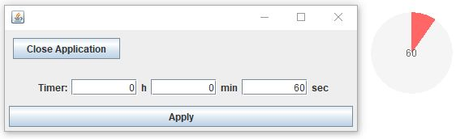

# PiPresentationTimer
A small Pie Chart that slowly fills red in a set timeframe to have a better overview over the time left in a presentation.

It sits on the upper right side of the screen, partially transparent.

The controlls are easy:
+ Left-Click: timer reset
+ Right-Click: options menu to set a different duration or close the application
+ the options menu may be hidden through closing its window

